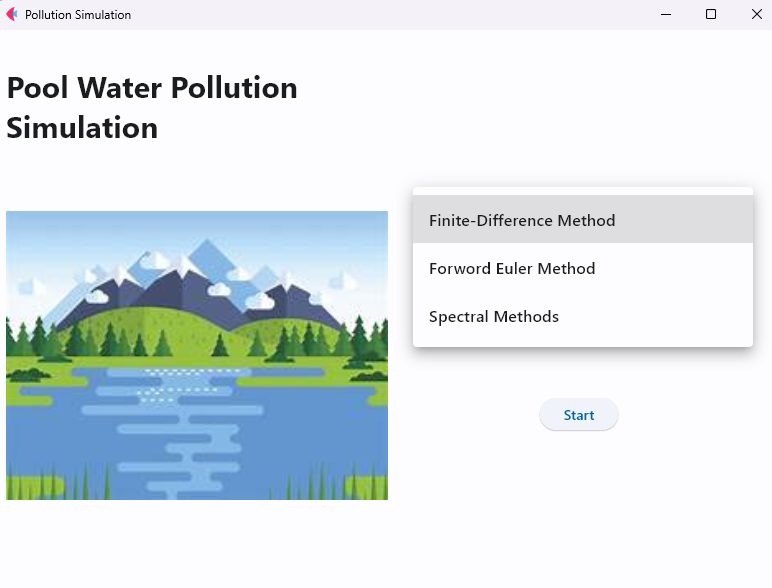
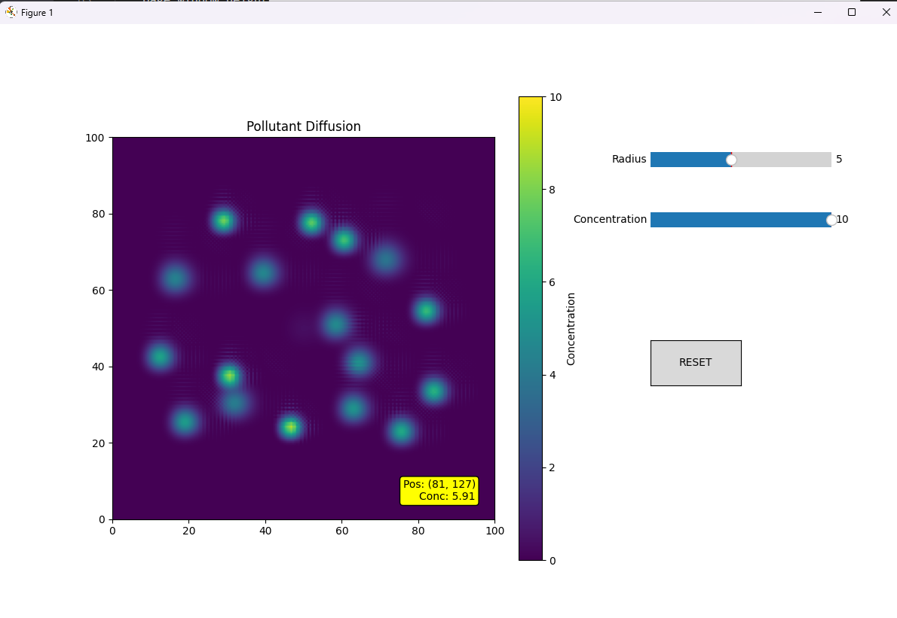

# Numerical-Method final project
-E94114073 張哲維   
-指導老師: 游濟華  
-主題: 池水擴散模擬  
-內容: 包括了 flet做的GUI選單介面，搭配三種計算擴散方程的方法，並使用matplotlib做的互動式介面去模擬池水汙染情形。  
-使用方法:  
執行gui.py檔案，接著會跳出以下畫面  

接著選擇模式並按下start鍵，就會載入另一個視窗

對著左邊的方框內按滑鼠做鍵式新增汙染源，而右鍵為查看濃度  
右邊的兩個拉桿為調整汙染源的半徑大小和濃度  
如果要將圖內的的所有汙染源清空則使用reset按鍵
